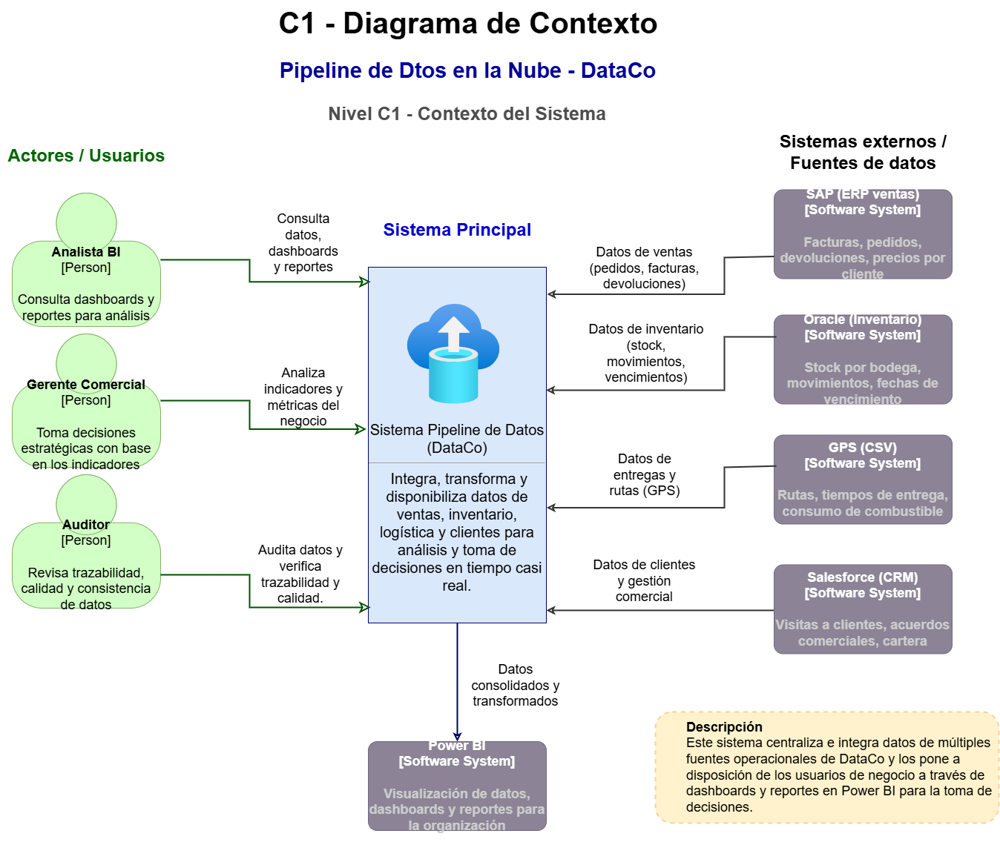
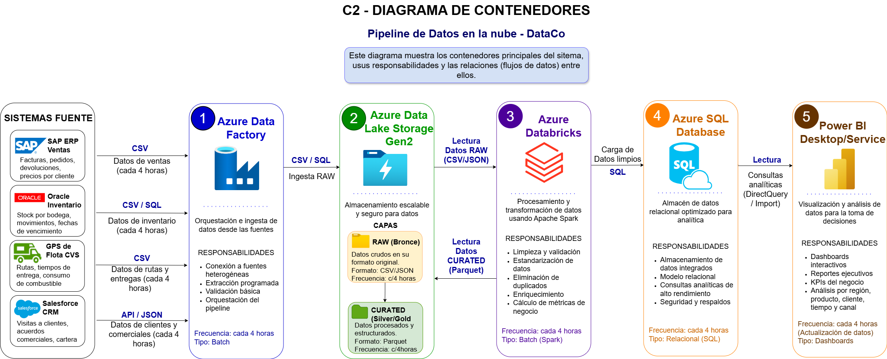
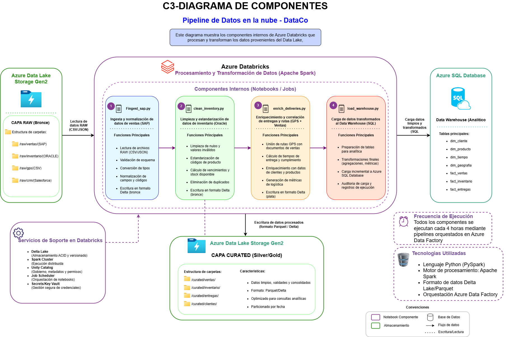

# Caso 2: Pipeline de Datos en la Nube - DataCo

## 1. Ficha General
* **Integrantes:** Julian, Mateo Sanchez, Nataly Rivera Agudelo, Yesica Carolina Restrepo Acosta, Yuli Tatiana Marin Rondón
* **Institución:** Tecnológico de Antioquia - Institución Universitaria
* **Curso:** Computación en la Nube 2026-1
* **Profesor:** Julian David Florez Sanchez

## Índice
* Ficha General
* Matriz de control de cambios
* Contexto del proyecto
* Objetivos
* Requerimientos y Restricciones
* Arquitectura de Solución
* Modelo C4
* ADRs
* Implementación del Pipeline
* Evidencias
* Conclusiones
* Referencias

## 3. Matriz de control de cambios
| Versión | Fecha | Responsable | Descripcion |
|---|---|---|---|
| 1.0 | 28/4/26 | Mateo sanchez  | Creación estructura inicial README |
| 2.0 | 28/4/26 | Mateo sanchez| Creación diagrama c1|
| 2.0 | 5/5/26 | Yesica Restrepo | Creación diagrama c2|
| 4.0 | 6/5/26 | Nataly Rivera| Creación diagrama c3|
| 5.0 | 7/5/26 | Yuli Marin | Creación de objetivos, requerimientos y Arquitectura de solución|
| 6.0 | 7/5/26 | Julian | Servicios implementados|

## 4. Contexto del Proyecto
DataCo es una empresa colombiana de distribución con operaciones en 12 departamentos del país. Actualmente presenta problemas de fragmentación de datos debido a que la información se encuentra distribuida en cuatro sistemas aislados: SAP, Oracle, GPS y Salesforce.

### Problemas identificados a resolver:
* **Reportes manuales:** El equipo tarda hasta 5 días habiles en consolidar información en Excel.
* **Inconsistencia:** Datos de clientes y productos no coinciden entre sistemas.
* **Rezago:** Decisiones tomadas con datos de hasta 72 horas de antigüedad.
*  **Trazabilidad inesistente:** no hay forma de correlacionar una factura de SAP con su entrega real en GPS.
*   **Escalabilidad nula:** servidor antiguo.

Para solucionar estas problemáticas, se propone implementar un pipeline de datos en Microsoft Azure utilizando Azure Data Factory, Data Lake Storage Gen2, Databricks, Azure SQL Database y Power BI, con el fin de automatizar el procesamiento de datos y mejorar la disponibilidad y calidad de la información.

## 5. Objetivos
**5.1 Objetivo General**

Diseñar e implementar un pipeline de datos en Azure para centralizar, transformar y analizar la información de DataCo mediante servicios cloud escalables.

**5.2 Objetivos Específicos**
* Integrar múltiples fuentes de datos.
* Automatizar procesos ETL.
* Mejorar calidad de datos.
* Generar dashboards automáticos.
* Reducir tiempos de procesamiento.

# 6. Requerimientos de la Arquitectura

## 6.1 Requerimientos Funcionales

| ID | Requerimiento Funcional | Solución Implementada | Restricciones Consideradas |
|---|---|---|---|
| RF-01 | El sistema debe permitir la ingesta automática de datos desde múltiples fuentes (SAP, Oracle, GPS y Salesforce). | Se implementó Azure Data Factory para automatizar la extracción e ingesta de archivos CSV, JSON y datos comerciales hacia el Data Lake. | SAP no dispone de API REST y la integración debe realizarse mediante archivos exportados. |
| RF-02 | El sistema debe almacenar datos crudos y procesados en capas separadas. | Se configuró Azure Data Lake Storage Gen2 con zonas `raw` y `curated`. | Se priorizó una solución escalable y de bajo costo utilizando el tier LRS Standard. |
| RF-03 | El sistema debe limpiar y transformar los datos antes de su análisis. | Azure Databricks ejecuta notebooks para eliminar duplicados, corregir formatos de fecha y estandarizar información. | El equipo tiene conocimientos básicos de Python, por lo que se utilizaron transformaciones simples y automatizadas. |
| RF-04 | El sistema debe consolidar la información en un almacén analítico centralizado. | Los datos transformados se cargan en Azure SQL Database mediante procesos batch. | Se utilizó el Free Tier de Azure SQL para ajustarse al presupuesto del proyecto. |
| RF-05 | El sistema debe permitir la visualización automática de reportes y dashboards. | Power BI se conectó directamente a Azure SQL Database para generar reportes analíticos. | La empresa ya posee licencias Power BI Desktop y no puede asumir costos adicionales. |
| RF-06 | El sistema debe ejecutar el pipeline automáticamente cada 4 horas. | Azure Data Factory programa y orquesta las ejecuciones del pipeline ETL. | Se buscó reducir el rezago de información de hasta 72 horas identificado en el caso. |
| RF-07 | El sistema debe mantener trazabilidad de las transformaciones realizadas sobre los datos. | Databricks registra las transformaciones y Azure SQL almacena datos procesados para auditoría. | Se debe cumplir con políticas internas de gobierno y control de datos. |
| RF-08 | El sistema debe continuar procesando información aunque una fuente falle. | Azure Data Factory implementa pipelines independientes y reintentos automáticos. | El proyecto exige tolerancia a fallos parciales durante la ejecución. |

---

## 6.2 Requerimientos No Funcionales

| ID | Requerimiento No Funcional | Solución Implementada | Restricciones Consideradas |
|---|---|---|---|
| RNF-01 | El sistema debe soportar grandes volúmenes de datos. | Azure Data Lake y Databricks permiten procesamiento distribuido y almacenamiento escalable. | La arquitectura debe soportar hasta 5 millones de registros por ejecución. |
| RNF-02 | El sistema debe mantener un costo reducido durante la fase piloto. | Se utilizaron servicios gratuitos o Free Tier de Azure y Databricks Community Edition. | El presupuesto mensual no debe superar los 80 USD. |
| RNF-03 | El sistema debe garantizar disponibilidad periódica de la información. | Los pipelines se ejecutan automáticamente cada 4 horas mediante Azure Data Factory. | La gerencia requiere información actualizada para toma de decisiones. |
| RNF-04 | El sistema debe garantizar seguridad y control de acceso sobre los datos. | Azure SQL Database implementa autenticación y control de acceso por roles. | Los datos contienen información sensible de clientes y precios. |
| RNF-05 | El sistema debe garantizar calidad de datos superior al 98%. | Databricks aplica validaciones, eliminación de duplicados y normalización de datos. | El caso exige mejorar la confiabilidad de los reportes ejecutivos. |
| RNF-06 | El sistema debe ser mantenible y fácil de administrar. | La solución se dividió en servicios independientes y notebooks modulares. | El equipo posee experiencia limitada en Spark y administración avanzada. |
| RNF-07 | El sistema debe permitir consultas analíticas eficientes. | Azure SQL Database optimiza el almacenamiento relacional para Power BI. | Se requiere análisis rápido de ventas, clientes y regiones. |
| RNF-08 | El sistema debe ser escalable para futuras integraciones. | La arquitectura cloud permite agregar nuevas fuentes y procesos sin rediseñar el pipeline. | DataCo maneja múltiples líneas de negocio y crecimiento continuo. |

## 7. Arquitectura de Solución
La solución propuesta para DataCo consiste en un pipeline de datos en la nube basado en servicios de Microsoft Azure, diseñado para automatizar la ingesta, transformación, almacenamiento y visualización de la información empresarial.

La arquitectura implementada permite integrar datos provenientes de múltiples sistemas fuente, mejorar la calidad de la información y reducir los tiempos de generación de reportes.

## 7.1 Servicios implementados

| Servicio | Función |
|---|---|
| Azure Data Factory | Orquestación e ingesta automática de datos |
| Data Lake Storage Gen2 | Almacenamiento de datos raw y curated |
| Azure Databricks | Limpieza y transformación de datos |
| Azure SQL Database | Almacén relacional final |
| Power BI | Visualización y análisis de datos |

## 7.2 Flujo de Datos
* Los archivos CSV son cargados en la zona raw del Data Lake.
* Azure Data Factory detecta e ingesta los archivos.
* Azure Databricks ejecuta procesos de limpieza y transformación.
* Los datos procesados son almacenados en Azure SQL Database.
* Power BI consume la información para generar dashboards automáticos.

## 7.3 Beneficios
* Automatización del procesamiento de datos.
* Reducción de procesos manuales en Excel.
* Mejora en la calidad de datos.
* Escalabilidad en la nube.
* Actualización periódica de reportes.
* Centralización de la información empresarial.

## 8. Modelo C4
En esta sección se detalla la arquitectura de la solución utilizando el modelo C4.

### 8.1 Nivel 1: Diagrama de Contexto
El diagrama de contexto representa la interacción entre el sistema principal de DataCo, los actores del negocio y las fuentes externas de información. El sistema centraliza los datos provenientes de SAP, Oracle, GPS y Salesforce para disponibilizarlos mediante dashboards y reportes en Power BI. Los principales usuarios del sistema son el Analista BI, el Gerente Comercial y el Auditor, quienes utilizan la información para análisis, toma de decisiones y validación de trazabilidad y calidad de datos.

### 8.2 Nivel 2: Diagrama de Contenedores
El diagrama de contenedores muestra los principales servicios Azure utilizados en la arquitectura del pipeline de datos y el flujo de información entre ellos. Azure Data Factory realiza la orquestación e ingesta de datos desde los sistemas fuente hacia Azure Data Lake Storage Gen2, donde los archivos son almacenados en capas RAW y CURATED. Posteriormente, Azure Databricks ejecuta los procesos de limpieza, validación y transformación de los datos utilizando Apache Spark. Los datos procesados son cargados en Azure SQL Database para su análisis y finalmente consumidos por Power BI mediante dashboards y reportes actualizados automáticamente cada 4 horas.

### 8.3 Nivel 3: Diagrama de Componentes
El diagrama de componentes detalla la estructura interna de Azure Databricks y los notebooks encargados del procesamiento de datos. Cada componente cumple una función específica dentro del pipeline ETL: ingestión de datos desde la capa RAW, limpieza y validación de inventarios, enriquecimiento de entregas y carga final al Data Warehouse en Azure SQL Database. Además, el modelo incluye servicios de soporte como Delta Lake, Spark Cluster y Job Scheduler para garantizar procesamiento distribuido, control de versiones y automatización de ejecuciones.

## 9.ADRs

## 10.Implementación del Pipeline

## 11.Evidencias

## 12.Conclusiones

## 13.Referencias
