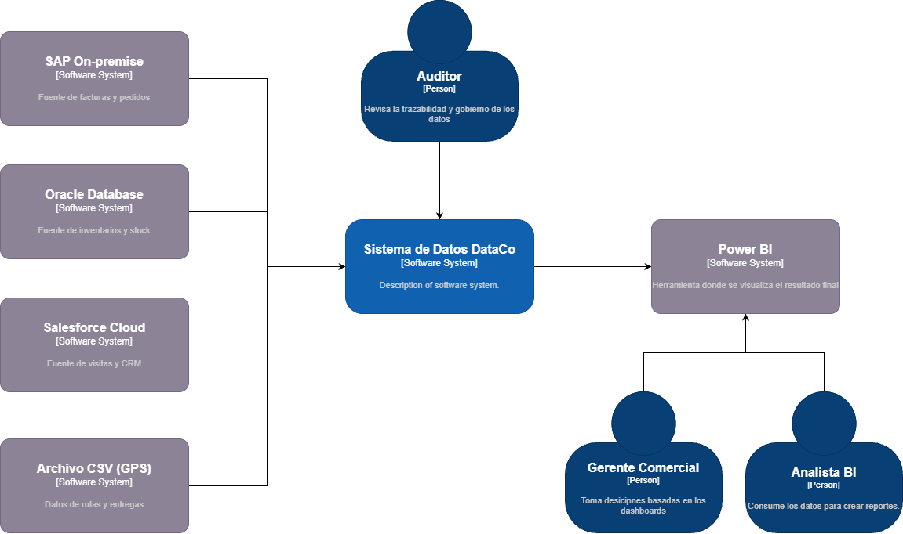

# Caso 2: Pipeline de Datos en la Nube - DataCo

## 1. Ficha General
* **Integrantes:** [Nombre 1], [Nombre 2], [Nombre 3], [Nombre 4]
* **Institución:** Tecnológico de Antioquia - Institución Universitaria
* **Curso:** Computación en la Nube 2026-1
* **Profesor:** Julian David Florez Sanchez

## 2. Contexto del Proyecto
[cite_start]DataCo es una empresa de distribución con operaciones en 12 departamentos de Colombia[cite: 30]. [cite_start]Actualmente enfrenta problemas críticos de fragmentación de datos en cuatro sistemas aislados (SAP, Oracle, GPS y Salesforce)[cite: 35, 36].

### Problemas identificados a resolver:
* [cite_start]**Reportes manuales:** El equipo tarda hasta 5 días en consolidar información en Excel[cite: 38, 39].
* [cite_start]**Inconsistencia:** Datos de clientes y productos no coinciden entre sistemas[cite: 41].
* [cite_start]**Rezago:** Decisiones tomadas con datos de hasta 72 horas de antigüedad[cite: 40].# DataCo-Cloud-Pipeline

## 3. Modelo C4
En esta sección se detalla la arquitectura de la solución utilizando el modelo C4.

### 3.1 Nivel 1: Diagrama de Contexto
El siguiente diagrama muestra cómo el Sistema de Datos de DataCo interactúa con los usuarios y los sistemas fuente existentes.

**Elementos del Sistema:**
* **Sistema de Datos DataCo:** Solución centralizada encargada de la ingesta, transformación y carga de datos.
* **Sistemas Fuente:** SAP (Ventas), Oracle (Inventario), Salesforce (CRM) y GPS (Logística).
* **Usuarios:** El Gerente Comercial y el Analista de BI consumen los datos procesados, mientras que el Auditor supervisa la trazabilidad.
